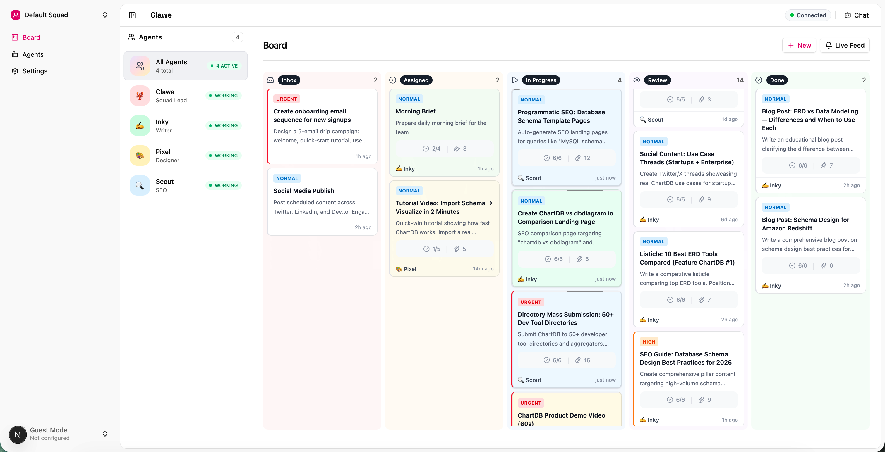

<div align="center">
  
  <p><strong>A multi-agent coordination system powered by <a href="https://github.com/openclaw/openclaw">OpenClaw</a>.</strong></p>
  <p>Deploy a team of AI agents that work together, each with their own identity, workspace, and scheduled heartbeats. Coordinate tasks, share context, and deliver notifications in near real-time.</p>
</div>

<div align="center">
  <video src="https://github.com/user-attachments/assets/d2f892d9-4c32-4c31-95e5-222d4ea87592" width="600" controls>
    <a href="https://github.com/user-attachments/assets/d2f892d9-4c32-4c31-95e5-222d4ea87592">
      
      <br>▶ Watch demo
    </a>
  </video>
</div>

## Features

- Run multiple AI agents with distinct roles and personalities
- Agents wake on cron schedules to check for work
- Kanban-style task management with assignments and subtasks
- Instant delivery of @mentions and task updates
- Agents collaborate through shared files and Convex backend
- Monitor squad status, tasks, and chat with agents from a web dashboard

## Quick Start

### Prerequisites

- Docker & Docker Compose
- [Convex](https://convex.dev) account (free tier works)
- Anthropic API key

### 1. Clone and Setup

```bash
git clone https://github.com/getclawe/clawe.git
cd clawe
cp .env.example .env
```

### 2. Configure Environment

Edit `.env`:

```bash
# Required
ANTHROPIC_API_KEY=sk-ant-...
SQUADHUB_TOKEN=your-secure-token
CONVEX_URL=https://your-deployment.convex.cloud

# Optional
OPENAI_API_KEY=sk-...  # For image generation
```

### 3. Deploy Convex Backend

```bash
pnpm install
cd packages/backend
npx convex deploy
```

### 4. Start the System

**Production (recommended):**

```bash
./scripts/start.sh
```

This script will:

- Create `.env` from `.env.example` if missing
- Auto-generate a secure `SQUADHUB_TOKEN`
- Validate all required environment variables
- Build necessary packages
- Start the Docker containers

**Development:**

```bash
# Start squadhub gateway only (use local web dev server)
pnpm dev:docker

# In another terminal, start web + Convex
pnpm dev
```

The production stack starts:

- **squadhub**: Gateway running all agents
- **watcher**: Notification delivery + cron setup
- **clawe**: Web dashboard at http://localhost:3000

## The Squad

Clawe comes with 4 pre-configured agents:

| Agent    | Role           | Heartbeat    |
| -------- | -------------- | ------------ |
| 🦞 Clawe | Squad Lead     | Every 15 min |
| ✍️ Inky  | Content Editor | Every 15 min |
| 🎨 Pixel | Designer       | Every 15 min |
| 🔍 Scout | SEO            | Every 15 min |

Heartbeats are staggered to avoid rate limits.

## Routines

Schedule recurring tasks that automatically create inbox items:

- Configure day/time schedules per routine
- 1-hour trigger window for crash tolerance
- Tasks created with Clawe as the creator
- Manage via Settings → General in the dashboard

## Architecture

```
┌─────────────────────────────────────────────────────────────┐
│                     DOCKER COMPOSE                          │
├─────────────────┬─────────────────────┬─────────────────────┤
│    squadhub     │       watcher       │        clawe        │
│                 │                     │                     │
│  Agent Gateway  │  • Register agents  │  Web Dashboard      │
│  with 4 agents  │  • Setup crons      │  • Squad status     │
│                 │  • Deliver notifs   │  • Task board       │
│                 │                     │  • Agent chat       │
└────────┬────────┴──────────┬──────────┴──────────┬──────────┘
         │                   │                     │
         └───────────────────┼─────────────────────┘
                             │
                    ┌────────▼────────┐
                    │     CONVEX      │
                    │   (Backend)     │
                    │                 │
                    │  • Agents       │
                    │  • Tasks        │
                    │  • Notifications│
                    │  • Activities   │
                    └─────────────────┘
```

## Project Structure

```
clawe/
├── apps/
│   ├── web/              # Next.js dashboard
│   └── watcher/          # Notification watcher service
├── packages/
│   ├── backend/          # Convex schema & functions
│   ├── cli/              # `clawe` CLI for agents
│   ├── shared/           # Shared squadhub client
│   └── ui/               # UI components
└── docker/
    └── squadhub/
        ├── Dockerfile
        ├── entrypoint.sh
        ├── scripts/      # init-agents.sh
        └── templates/    # Agent workspace templates
```

## CLI Commands

Agents use the `clawe` CLI to interact with the coordination system:

```bash
# Check for notifications
clawe check

# List tasks
clawe tasks
clawe tasks --status in_progress

# View task details
clawe task:view <task-id>

# Update task status
clawe task:status <task-id> in_progress
clawe task:status <task-id> review

# Add comments
clawe task:comment <task-id> "Working on this now"

# Manage subtasks
clawe subtask:add <task-id> "Research competitors"
clawe subtask:check <task-id> 0

# Register deliverables
clawe deliver <task-id> "Final Report" --path ./report.md

# Send notifications
clawe notify <session-key> "Need your review on this"

# View squad status
clawe squad

# Activity feed
clawe feed
```

## Agent Workspaces

Each agent has an isolated workspace with:

```
/data/workspace-{agent}/
├── AGENTS.md      # Instructions and conventions
├── SOUL.md        # Agent identity and personality
├── USER.md        # Info about the human they serve
├── HEARTBEAT.md   # What to do on each wake
├── MEMORY.md      # Long-term memory
├── TOOLS.md       # Local tool notes
└── shared/        # Symlink to shared state
    ├── WORKING.md # Current team status
    └── WORKFLOW.md # Standard operating procedures
```

## Customization

### Adding New Agents

1. Create workspace template in `docker/squadhub/templates/workspaces/{name}/`
2. Add agent to `docker/squadhub/templates/config.template.json`
3. Add agent to watcher's `AGENTS` array in `apps/watcher/src/index.ts`
4. Rebuild: `docker compose build && docker compose up -d`

### Changing Heartbeat Schedules

Edit the `AGENTS` array in `apps/watcher/src/index.ts`:

```typescript
const AGENTS = [
  {
    id: "main",
    name: "Clawe",
    emoji: "🦞",
    role: "Squad Lead",
    cron: "0 * * * *",
  },
  // Add or modify agents here
];
```

## Development

### First-time setup

1. **Create `.env`** (if missing): `cp .env.example .env`  
   - Set `ANTHROPIC_API_KEY` (required for AI).  
   - For local Convex dev, `CONVEX_URL` and `NEXT_PUBLIC_CONVEX_URL` are set to `http://127.0.0.1:3210` in the generated `.env`; leave as-is or replace with a cloud deployment URL.

2. **Build shared packages** so the CLI and Convex can resolve workspace deps:
   ```bash
   pnpm --filter @clawe/shared build
   pnpm --filter @clawe/cli build
   ```

3. **Convex (local dev)**  
   The first time you run `pnpm dev`, Convex may prompt to configure a project. In an interactive terminal you can run:
   ```bash
   pnpm convex:dev
   ```
   and choose "new" project and "local" deployment. The repo is already set up to use a local deployment at `http://127.0.0.1:3210`. The sync script will set `NEXTAUTH_ISSUER_URL` and `NEXTAUTH_JWKS_URL` once the backend is up; if "Preparing" fails the first time, run `pnpm dev` again.

### Using self-hosted Convex

You can run your own Convex backend (e.g. [convex-backend](https://github.com/get-convex/convex-backend) Docker setup) and point Clawe at it.

1. **Run your Convex backend** (see the [self-hosting guide](https://github.com/get-convex/convex-backend/blob/main/self-hosted/README.md)). Generate an admin key on the backend, e.g.:
   ```bash
   docker compose exec backend ./generate_admin_key.sh
   ```

2. **Configure `.env`** with the same URL for the app and the CLI:
   ```bash
   CONVEX_URL=https://convex.yourdomain.com
   NEXT_PUBLIC_CONVEX_URL=https://convex.yourdomain.com
   CONVEX_SELF_HOSTED_URL=https://convex.yourdomain.com
   CONVEX_SELF_HOSTED_ADMIN_KEY=<your-admin-key>
   ```
   Use `http://host:3210` if your backend is on the default port and not behind HTTPS.

3. **Deploy functions and set auth env vars** (from repo root with `.env` loaded):
   ```bash
   pnpm convex:deploy
   ```
   This pushes your Convex functions and sets `NEXTAUTH_ISSUER_URL`, `NEXTAUTH_JWKS_URL`, and `WATCHER_TOKEN` on your self-hosted deployment.

4. **Start the app** (your Convex backend is already running separately). Run the web app and optionally the watcher; do not use `pnpm dev` for the backend (that starts Convex Cloud dev). From the repo root:
   ```bash
   pnpm dev:web
   ```
   In another terminal, to run the watcher (notifications, crons) against your self-hosted Convex:
   ```bash
   pnpm --filter @clawe/watcher dev
   ```

### Running the app

```bash
# Install dependencies
pnpm install

# Terminal 1: Start Convex dev server
pnpm convex:dev

# Terminal 2: Start squadhub gateway in Docker
pnpm dev:docker

# Terminal 3: Start web dashboard
pnpm dev:web

# Or run everything together (Convex + web, but not squadhub)
pnpm dev
```

### Useful Commands

```bash
# Build everything
pnpm build

# Type check
pnpm check-types

# Lint and format
pnpm check      # Check only
pnpm fix        # Auto-fix

# Deploy Convex to production
pnpm convex:deploy
```

### Using 1Password for credentials

You can keep secrets in [1Password](https://1password.com) and have the CLI inject them at runtime so they never live in `.env`.

1. **Install 1Password CLI** ([get started](https://developer.1password.com/docs/cli/get-started/)).

2. **Store secrets in 1Password**  
   Create an item (e.g. "Clawe" in vault "Private") with fields such as:
   - `ANTHROPIC_API_KEY`
   - `CONVEX_SELF_HOSTED_ADMIN_KEY` (if using self-hosted Convex)
   - Optionally: `SQUADHUB_TOKEN`, `OPENAI_API_KEY`, `NEXTAUTH_SECRET`

3. **Create `.env.op` from the template**  
   Copy `.env.op.template` to `.env.op` and replace the placeholder secret references with your vault/item/field paths (e.g. `op://Private/Clawe/ANTHROPIC_API_KEY`). See [secret reference syntax](https://developer.1password.com/docs/cli/secret-reference-syntax/).

4. **Run commands with 1Password**  
   Use the `:op` scripts so secrets are loaded from 1Password and merged with your `.env`:
   ```bash
   pnpm dev:op           # Full dev stack with secrets from 1Password
   pnpm dev:web:op       # Web only with 1Password
   pnpm convex:deploy:op # Deploy Convex (e.g. self-hosted) with 1Password
   ```
   If `.env.op` is missing, the non-`:op` scripts (e.g. `pnpm dev`) still work with `.env` only.

### Deploy to Coolify 2

Deploy the app to **Coolify 2** (self-hosted). Not Coolify 1. Not CapRover/capicoolify.

1. **In Coolify 2:** Create an application linked to this repo (e.g. GitHub source). Set build context to repo root and Dockerfile path to `apps/web/Dockerfile` for the web app. Note the **resource UUID** (from the app’s URL or **Resources** in the UI).

2. **Create an API token** in Coolify: **Keys & Tokens** → **API tokens**.

3. **Store in 1Password** (recommended): Add a item (e.g. "Clawe" or "Coolify 2") with:
   - `COOLIFY_URL` — your Coolify 2 base URL (e.g. `https://coolify.example.com`; if the API is under `/api/v1`, use `https://coolify.example.com/api/v1`)
   - `COOLIFY_API_TOKEN` — token from step 2
   - `COOLIFY_RESOURCE_UUID` — the application resource UUID from step 1

4. **Add to `.env.op`** (as 1Password secret references), e.g.:
   ```bash
   COOLIFY_URL=op://Private/Coolify2/COOLIFY_URL
   COOLIFY_API_TOKEN=op://Private/Coolify2/COOLIFY_API_TOKEN
   COOLIFY_RESOURCE_UUID=op://Private/Coolify2/COOLIFY_RESOURCE_UUID
   ```

5. **Deploy:**
   ```bash
   pnpm deploy:coolify:op
   ```
   Or with credentials in `.env`: `pnpm deploy:coolify`. Optional: `COOLIFY_FORCE=1` to force rebuild without cache.

## Environment Variables

| Variable                         | Required | Description                                                |
| -------------------------------- | -------- | ---------------------------------------------------------- |
| `ANTHROPIC_API_KEY`              | Yes      | Anthropic API key for Claude                               |
| `SQUADHUB_TOKEN`                 | Yes      | Auth token for squadhub gateway                            |
| `CONVEX_URL`                     | Yes      | Convex deployment URL (Cloud or self-hosted backend URL)   |
| `NEXT_PUBLIC_CONVEX_URL`         | Yes      | Same as `CONVEX_URL` (exposed to browser; keep in sync)   |
| `CONVEX_SELF_HOSTED_URL`         | No       | Self-hosted Convex backend URL (for CLI deploy/env set)  |
| `CONVEX_SELF_HOSTED_ADMIN_KEY`   | No       | Admin key from self-hosted backend (for CLI)               |
| `OPENAI_API_KEY`                 | No       | OpenAI key (for image generation)                         |
